<p align="center">
  
</p>

<h1 align="center">SCIP</h1>

<p align="center">
  <b>Supply Chain Intelligence Platform</b><br>
  A desktop application that tracks cargo from a supplier's gate to a customer's dock,<br>
  and decides what to order, from whom, when and by which route.
</p>

<p align="center">
  <a href="https://github.com/R2osters/supply-chain-project/releases/latest"></a>
  <a href="https://github.com/R2osters/supply-chain-project/releases/latest"></a>
  <a href="https://github.com/R2osters/supply-chain-project/releases/latest"></a>
  <a href="https://github.com/R2osters/supply-chain-project/releases/latest"></a>
</p>

<p align="center">
  <a href="https://r2osters.github.io/supply-chain-project/">Website</a> ·
  <a href="#download-and-install">Install</a> ·
  <a href="#the-screens">Screens</a> ·
  <a href="CONCEPT.md">What the AI really is</a> ·
  <a href="TRACKING.md">Trucks on the map</a>
</p>

<p align="center">
  <a href="docs/captures/v0.3.0/control.png">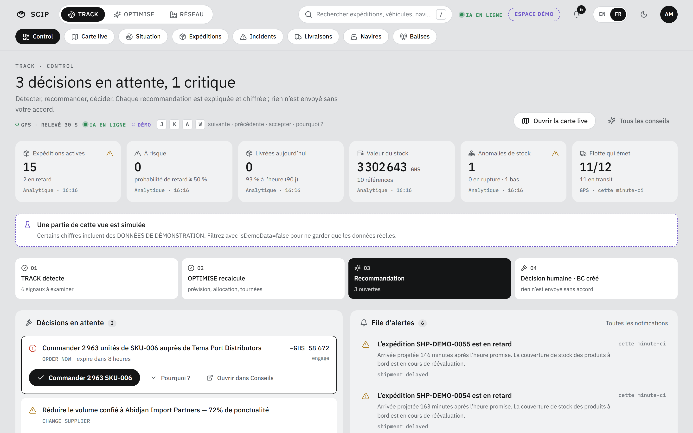</a>
</p>

<p align="center">
  <i>SCIP 0.3.0 on its demo data. You download one file, install it, and it runs on your computer:<br>
  no server to deploy, no account to open, no API key to buy.</i>
</p>

---

## Download and install

| System | File on the [latest release](https://github.com/R2osters/supply-chain-project/releases/latest) | Needs | Install |
|---|---|---|---|
| **Windows** | `SCIP-Setup-<version>.exe` | Windows 10 (1809) or later, 2 GB of disk, 4 GB of memory | Run it and follow SCIP's own installer. No administrator rights. |
| **macOS** | `SCIP-<version>-macos-arm64.dmg` | Apple Silicon, macOS 13.5 or later | Open it, drag SCIP into Applications. |
| **Linux** | `SCIP-<version>-linux-amd64.deb` | x86_64, Ubuntu 22.04 or Debian 12, or later | `sudo apt install ./SCIP-<version>-linux-amd64.deb` |

Then open **SCIP** like any other program. The first time, choose between your own company
(an empty database and an administrator account) and the **demonstration**, which loads a
fictional distributor, *Demo Distribution Ghana*, with its warehouses, suppliers, trucks and ships.

<table>
<tr>
<td width="33%" valign="top">
<a href="docs/captures/v0.3.0/installeur-01-bienvenue.png">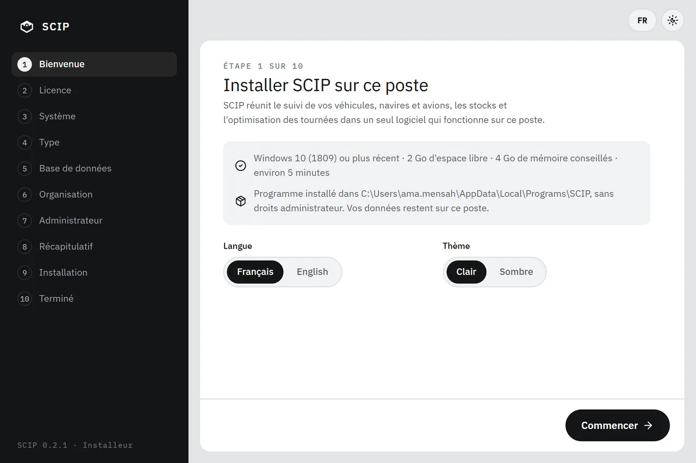</a>
<br><b>1 · Welcome</b><br>SCIP's own installer, in French or English.
</td>
<td width="33%" valign="top">
<a href="docs/captures/v0.3.0/installeur-04-type.png">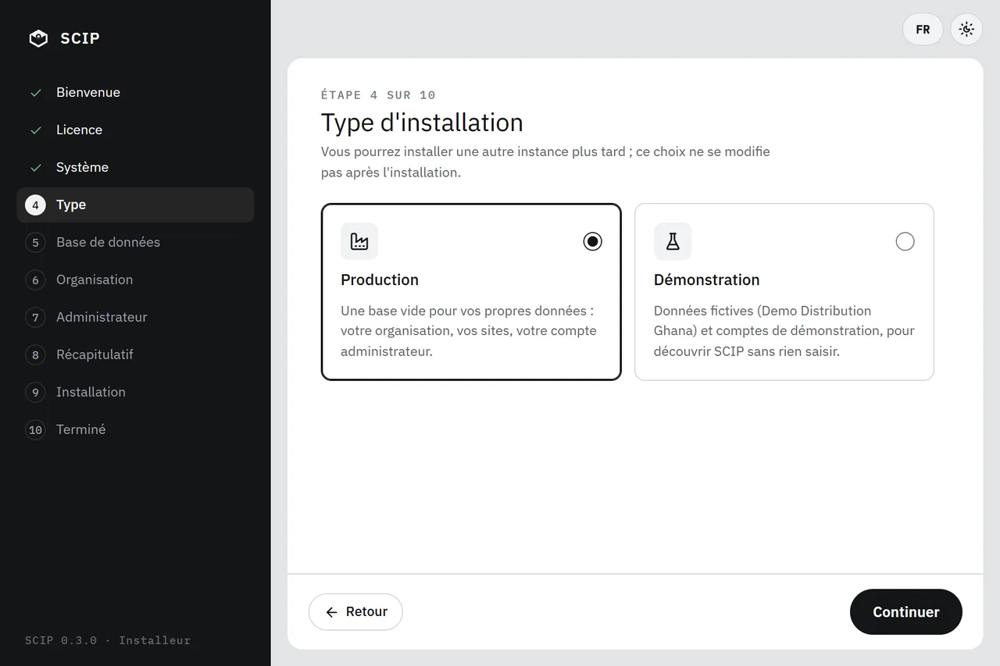</a>
<br><b>2 · Production or demonstration</b><br>An empty database for your company, or the fictional one to look around.
</td>
<td width="33%" valign="top">
<a href="docs/captures/v0.3.0/installeur-11-termine.png">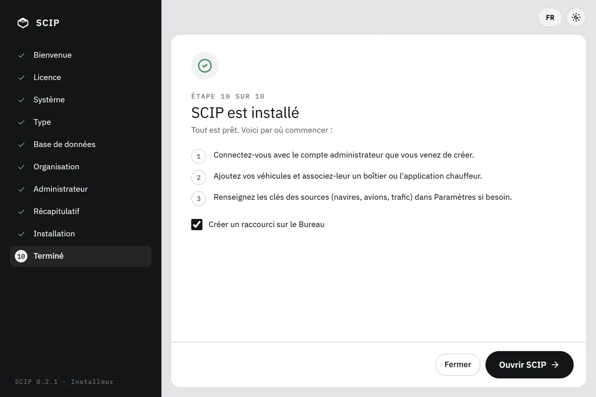</a>
<br><b>3 · Done</b><br>SCIP opens from the Start menu like any other program.
</td>
</tr>
</table>

What to expect, said plainly:

- **The packages are not signed with a paid certificate.** Windows SmartScreen warns before the
  installer runs ("More info" → "Run anyway"). macOS refuses the first launch until you allow it
  in System Settings → Privacy & Security → "Open Anyway". Each release carries a `SHA256SUMS`
  file to check the macOS and Linux downloads against.
- **Windows updates itself**: SCIP looks for a newer release, checks its size, its SHA-256 and an
  Ed25519 signature, backs the data up, then installs. On macOS and Linux an update is a new
  download.
- **The Windows installer is the one tried by hand.** The macOS and Linux packages are installed
  and exercised by every build on GitHub's runners; neither has yet been tried by a person on a
  real Mac or a real Linux desktop.
- **Uninstalling on Windows keeps your data** unless you tick the box that deletes it.

Installation on each system, backups, updates and the network: [DEPLOYMENT.md](DEPLOYMENT.md).

## What runs on your computer

SCIP is not a window onto a website. The program you install carries a whole stack and starts it
itself, on addresses only this computer can reach:

```
SCIP  (Tauri 2 shell, written in Rust)
├── window ── the interface (React, exported as static files)
└── supervisor: starts, watches and stops
    ├── PostgreSQL + PostGIS   the database, in your user profile
    ├── the API                NestJS on a bundled Node.js
    └── the AI engine          FastAPI, OR-Tools, scikit-learn, frozen into one program
```

- **Your data stays on the machine**, in one folder of your user profile
  (`%LOCALAPPDATA%\com.scip.desktop` on Windows). A backup is one `.scip-backup` file.
- **It works without a key.** Live ships (Baltic Sea), aircraft, disasters, weather and public
  cameras are free feeds. Optional keys (worldwide ships, road traffic, satellite fires) go in
  Réglages → Sources de données.
- **It works without Internet**, minus the live feeds: every map has an embedded basemap, so a
  room with no network still gets land, borders, roads and place names.
- **It answers this computer only**, until an administrator enables Réglages → Réseau local. Then
  drivers' phones open `http://<this PC>:3001/drive` and GT06 GPS trackers report on TCP port 5023.
- **If the AI engine fails to start, SCIP still opens**: tracking, receiving and stock keep
  working, and only the Optimise screens are degraded.

Why a desktop program and not a hosted service, and what that costs:
[ADR 0001](docs/adr/0001-logiciel-de-bureau-tout-en-un.md) ·
[docs/desktop-architecture.md](docs/desktop-architecture.md) · macOS and Linux:
[ADR 0002](docs/adr/0002-macos-et-linux.md).

## What it does

One product, two halves, and a closed loop between them:

```
TRACK observes      shipment SHP-DEMO-0055 will miss its promise
      ↓ durable domain event
OPTIMISE recomputes stock cover for the products on board
      ↓
OPTIMISE recommends order 2 963 units of SKU-006 from Tema Port Distributors,
                    with reasons, assumptions and a cost
      ↓ a human accepts
TRACK executes      a real draft purchase order exists and is tracked
```

That loop is not a diagram in a slide deck. It runs in the installed program, on the demo data,
and [**Verify it yourself**](#verify-it-yourself) walks it end to end in about three minutes.

| | Screens |
|---|---|
| **Track** | Control · Live map · Situation · Shipments · Incidents · Deliveries · Vessels · Trackers |
| **Optimise** | Advice · Forecasting · Allocation · Scenarios · Routes |
| **Network** | Suppliers · Orders · Stock · Master data |

## The screens

Real captures of the installed program on its demo data, interface in French, nothing retouched.
Click one to see it full size; the rest are in [docs/captures/](docs/captures/v0.2.1/README.md).

### Track: where the cargo is

<table>
<tr>
<td width="50%" valign="top">
<a href="docs/captures/v0.2.1/carte-live.png">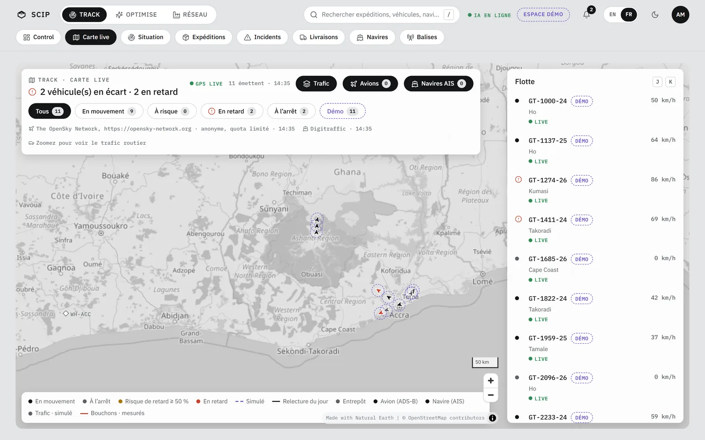</a>
<br><b>Carte live · Live map</b><br>Eleven trucks on real Ghanaian corridors, two of them late. Simulated vehicles carry a violet « démo » tag.
</td>
<td width="50%" valign="top">
<a href="docs/captures/v0.2.1/carte-live-camion-en-retard.png">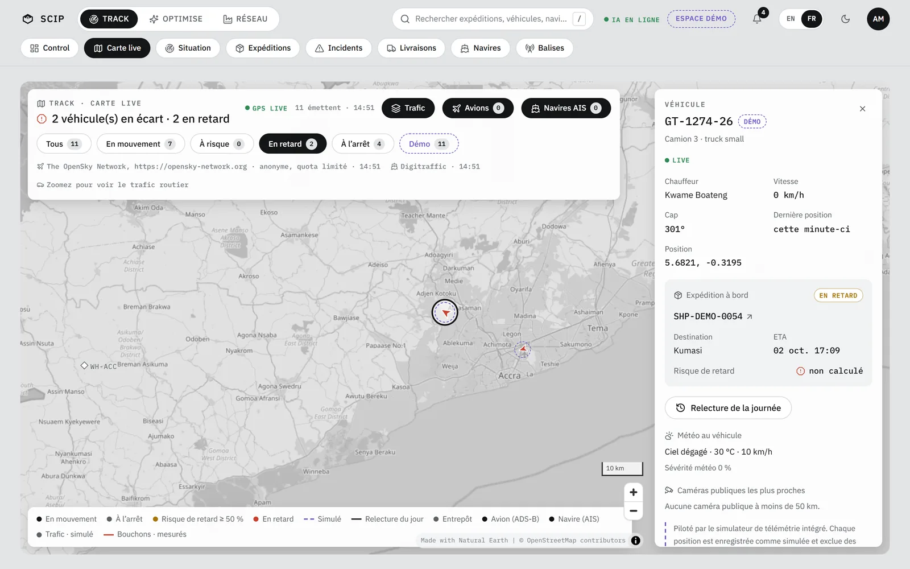</a>
<br><b>A late truck</b><br>The shipment on board, its destination, its ETA and the weather at the vehicle.
</td>
</tr>
<tr>
<td width="50%" valign="top">
<a href="docs/captures/v0.2.1/navires.png">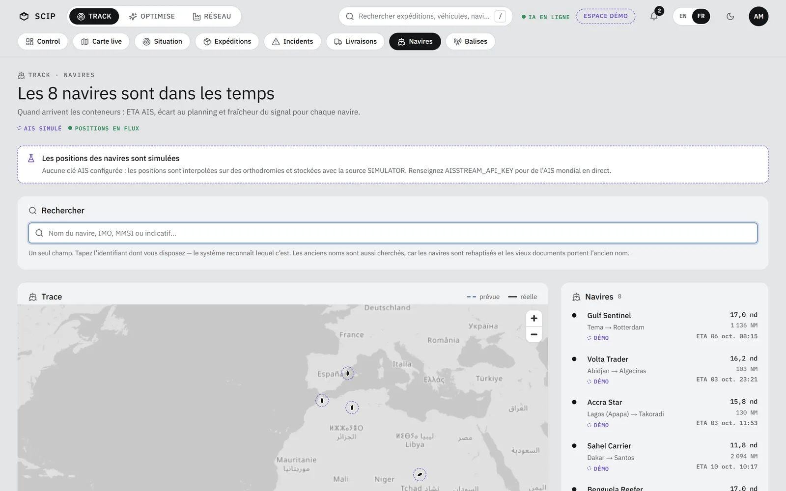</a>
<br><b>Navires · Vessels</b><br>Eight demo vessels; search by name, IMO or MMSI in one box.
</td>
<td width="50%" valign="top">
<a href="docs/captures/v0.2.1/situation.png">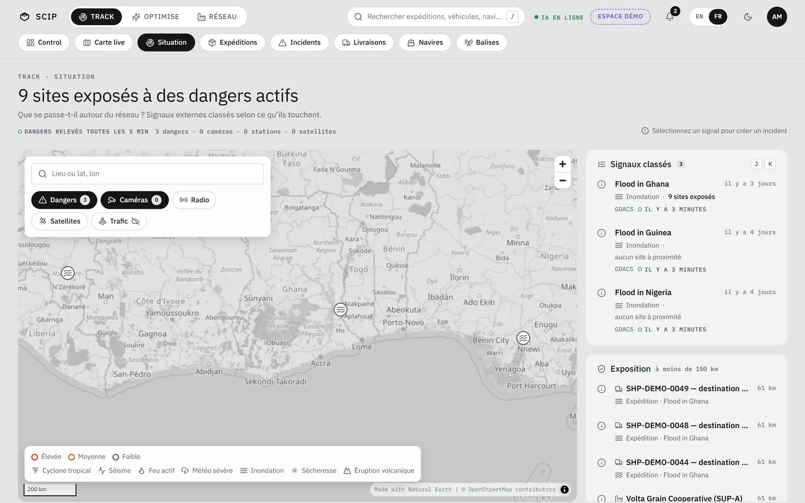</a>
<br><b>Situation</b><br>Earthquakes, cyclones, floods and fires from public feeds, ranked by which of your sites they expose.
</td>
</tr>
</table>

### Optimise: what to do about it

<table>
<tr>
<td width="50%" valign="top">
<a href="docs/captures/v0.3.0/conseils-pourquoi.png">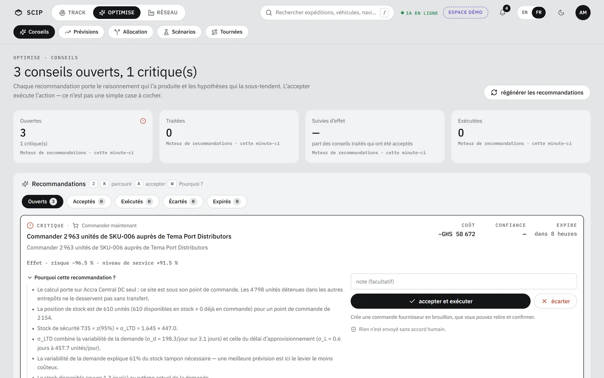</a>
<br><b>Conseils · Advice</b><br>Order 2 963 units of SKU-006 from Tema Port Distributors: the reasons, the assumptions, the cost, and one button to accept.
</td>
<td width="50%" valign="top">
<a href="docs/captures/v0.2.1/previsions.png">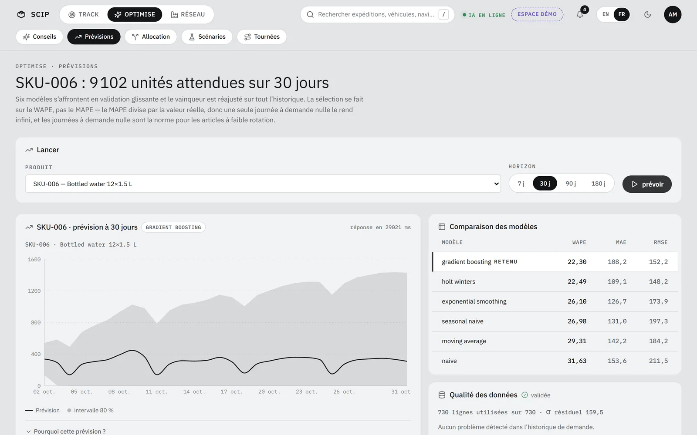</a>
<br><b>Prévisions · Forecasting</b><br>Six models compared by walk-forward validation; every score is shown, not just the winner's.
</td>
</tr>
<tr>
<td width="50%" valign="top">
<a href="docs/captures/v0.2.1/allocation.png">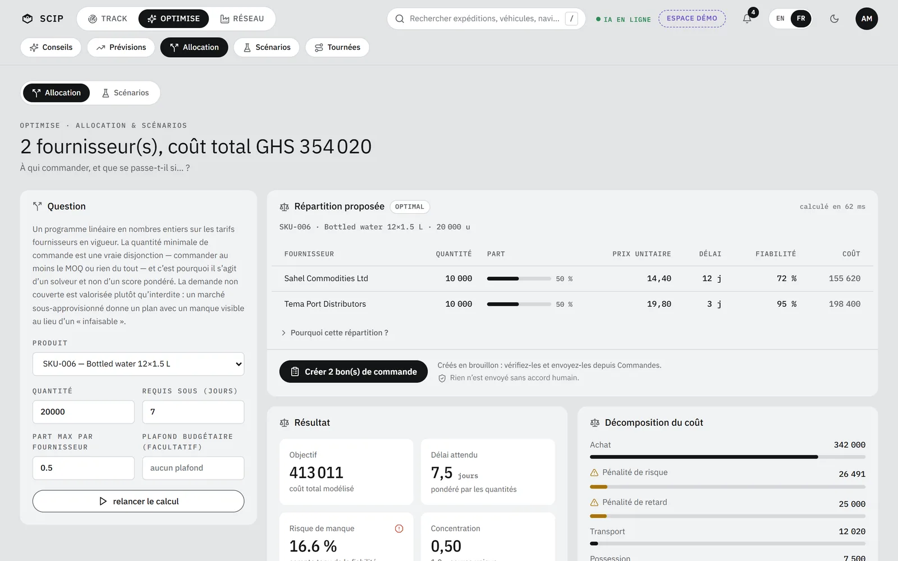</a>
<br><b>Allocation</b><br>20 000 units within 7 days, no supplier above half: the solver splits the order between two suppliers.
</td>
<td width="50%" valign="top">
<a href="docs/captures/v0.2.1/scenarios.png">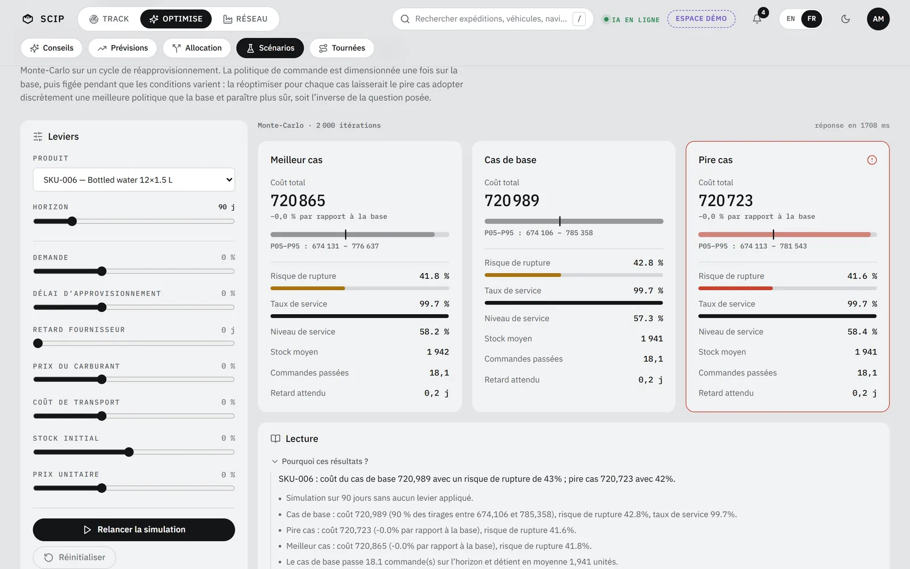</a>
<br><b>Scénarios · Scenarios</b><br>Monte-Carlo on a product: the risk of running out in the worst case.
</td>
</tr>
<tr>
<td width="50%" valign="top">
<a href="docs/captures/v0.2.1/tournees.png">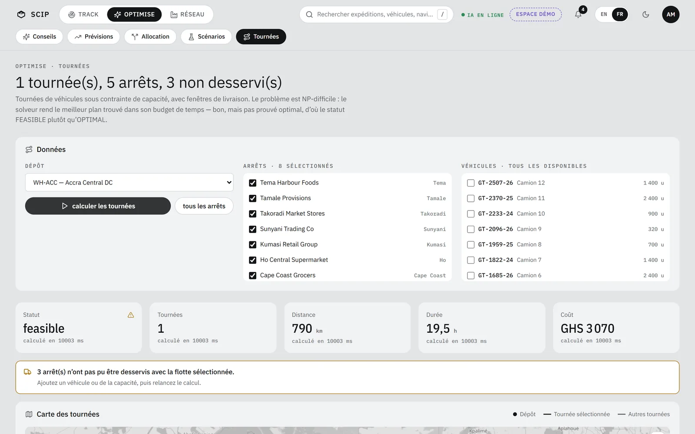</a>
<br><b>Tournées · Routes</b><br>Delivery rounds from a depot; stops that do not fit are listed, not hidden.
</td>
<td width="50%" valign="top">
<a href="docs/captures/v0.3.0/commandes.png">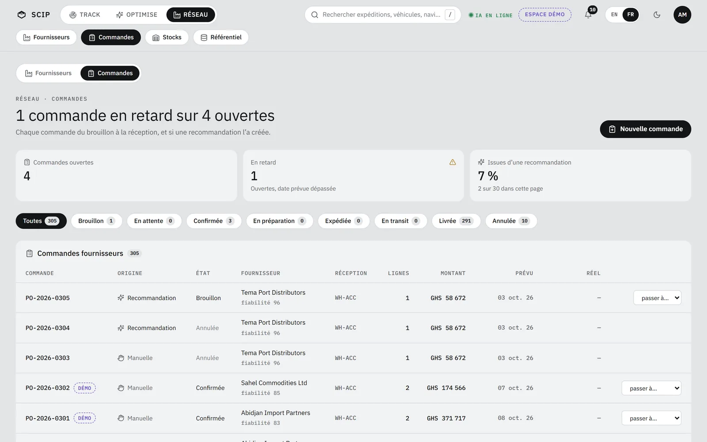</a>
<br><b>Commandes · Orders</b><br>The draft purchase order created by accepting the advice, its origin marked « Recommandation ».
</td>
</tr>
</table>

### Network: what you work with

<table>
<tr>
<td width="50%" valign="top">
<a href="docs/captures/v0.2.1/stocks-sku-006.png">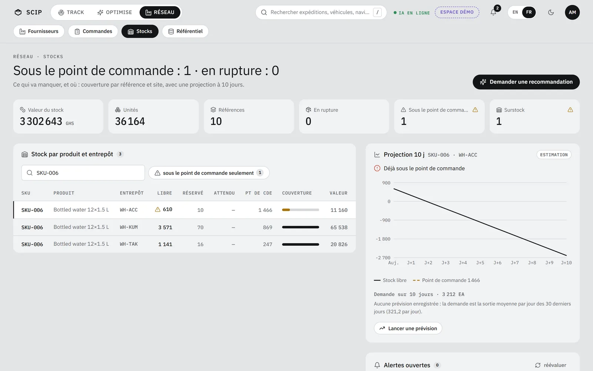</a>
<br><b>Stocks · Stock</b><br>SKU-006 at Accra Central DC, under its reorder point, with a 10-day projection.
</td>
<td width="50%" valign="top">
<a href="docs/captures/v0.2.1/fournisseurs.png">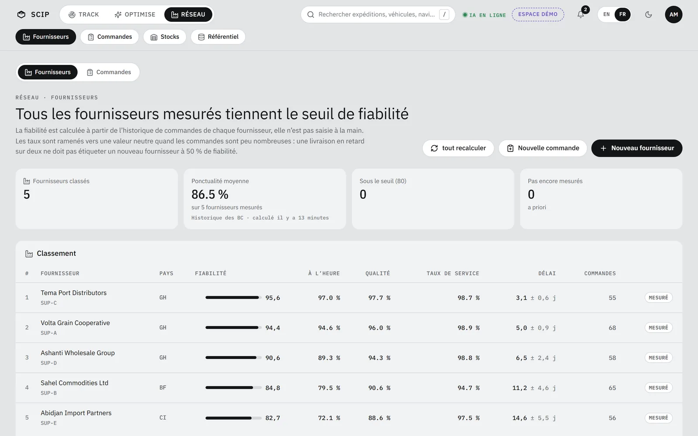</a>
<br><b>Fournisseurs · Suppliers</b><br>Reliability measured from the purchase-order history, not typed in.
</td>
</tr>
</table>

### The film

<a href="https://r2osters.github.io/supply-chain-project/">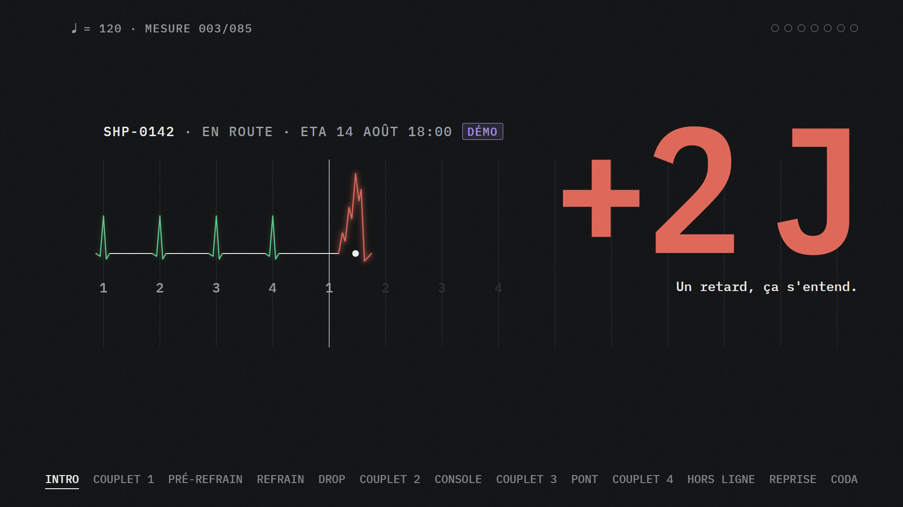</a>

*« Le Signal »*, 170 seconds of motion design about what SCIP does with a late shipment. Its
shipment `SHP-0142` is the film's own; it is not in the program. Watch it on the
[website](https://r2osters.github.io/supply-chain-project/).

---|---|
| **Track** | Control · Live map · Situation · Shipments · Incidents · Deliveries · Vessels · Trackers |
| **Optimise** | Advice · Forecasting · Allocation · Scenarios · Routes |
| **Network** | Suppliers · Orders · Stock · Master data |

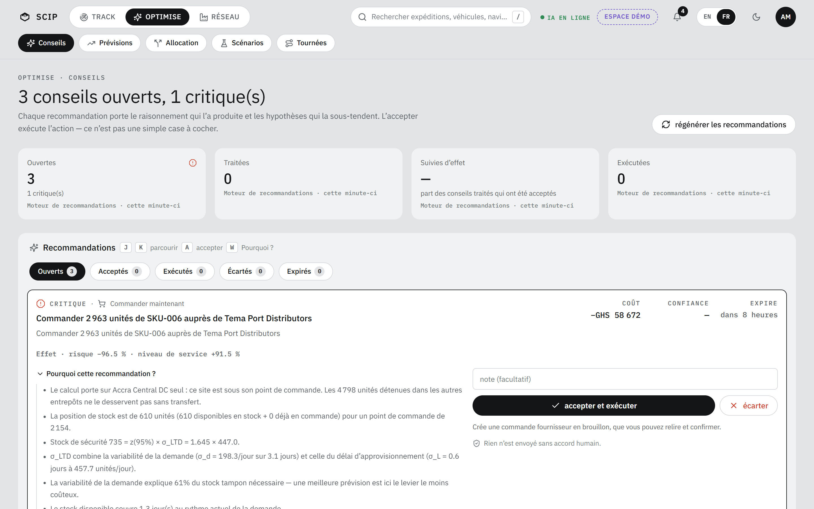 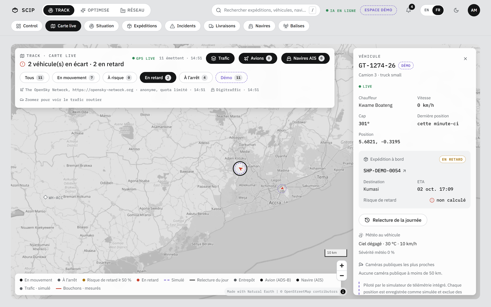

More screens, all real captures of the program: [docs/captures/](docs/captures/v0.2.1/README.md).

---

## Verify it yourself

Claims are cheap. Install SCIP, choose the **demonstration**, sign in with the demo administrator
account, and switch the interface to `EN` to find the screen names used here. Each of these takes
under a minute and either works or doesn't.

**The forecast really compares models.** Open *Forecasting*, pick `SKU-006`, run it. Six models
are scored by walk-forward validation and the table shows every WAPE, not just the winner's.
Selection is by WAPE rather than MAPE because MAPE divides by the actual, so one zero-demand day
makes it infinite — and zero-demand days are the norm for slow movers.

**The allocator really solves.** Open *Allocation*, pick a product, ask for 20 000 units within
7 days with a 50 % concentration cap. It solves in single-digit milliseconds and will often
**exclude the cheapest supplier** — a 12-day lead time breaches the deadline and a 75 % on-time
record carries a heavy risk penalty. That is the non-obvious answer, and it is the one a
weighted-scoring heuristic gets wrong.

**The loop really closes.** Open *Advice*, press **regenerate advice**, then **accept & execute**
on the order advice for `SKU-006`. A real draft purchase order appears under *Orders*, marked as
coming from a recommendation. Accepting performs the action — it does not tick a box.

**The map really moves.** Open *Live map*. Vehicles advance along real Ghanaian corridors, the
indicator reads `streaming` when the WebSocket is connected, and clicking one shows its driver,
speed, shipment and ETA.

**You can find a ship by typing its name.** Open *Vessels* and type `Ashanti`, or an IMO number, or
an MMSI — one box, and the system works out which kind of identifier it was given. Former names are
searched too, because ships are renamed on sale and old paperwork carries the old name. The eight
demo vessels sail real great-circle tracks between real ports on a liner rotation: when one
arrives, the return leg opens.

Three position sources, in precedence order. Only one ever runs — mixing feeds for one vessel
produces a track whose points disagree about where it was.

| Source | Cost | Coverage | Set |
|---|---|---|---|
| **MarineTraffic** | paid, per credit | terrestrial **+ satellite** — reaches mid-ocean | `MARINETRAFFIC_API_KEY` |
| **AISStream** | free | terrestrial, ~40–60 nm offshore | `AISSTREAM_API_KEY` |
| **Simulator** | — | great-circle tracks, stamped `SIMULATOR` | default |

The satellite difference is not cosmetic: on a terrestrial-only feed a ship crossing the Atlantic
disappears for a week in the middle of the passage, which is exactly when a shipper most wants to
know it is still making way.

Separately, and free with no key, every vessel carries **deep links to MarineTraffic and
VesselFinder**, matched on IMO where one exists. Those are ordinary hyperlinks and stay useful even
with a paid feed running — a second opinion, a photo of the hull, the port-call history this system
does not store.

**It speaks French.** The `EN`/`FR` switch sits on the login screen and in the top bar.
Numbers and dates follow the locale, not just the words: 2 906 717 and *13 août 26*.

---

## What is real, and what is stubbed

Real, computed, tested — not mocked:

ETA with propagated uncertainty · delay probability · anomaly detection · demand forecasting with
model selection · safety stock and reorder point · supplier scoring · multi-supplier allocation
(MILP) · vehicle routing (CVRP with time windows) · Monte-Carlo scenarios · risk scoring · the
recommendation engine and its execution path.

Deliberately stubbed, because they need paid third-party accounts this build has no credentials
for. Each sits behind an interface, returns clearly-labelled deterministic data, and is swapped in
by setting one environment variable:

| Stub | Swap in with |
|---|---|
| Road distance (great-circle × winding factor) | `OSRM_URL` |
| Traffic congestion (time-of-day model in the ETA engine) | live tiles on the map with `TOMTOM_API_KEY`; the ETA engine still uses the model |
| SMS (logged, never silently dropped) | any gateway |
| GPS hardware → the telemetry simulator | POST real fixes to `/telemetry/gps` |

Live without any key: weather (Open-Meteo, now feeding delay prediction), cyclones (NOAA NHC,
and GDACS outside NHC's basins), earthquakes (USGS), floods, droughts and volcanic eruptions
(GDACS), active fires (GDACS and NASA EONET), local news (GDELT), public traffic cameras, radio
stations and satellites. A free `FIRMS_MAP_KEY` is optional: it swaps in NASA FIRMS satellite fire
hotspots. See [docs/INTEL.md](docs/INTEL.md) for sources, licences and the Situation screen.

**Nothing synthetic is presented as real.** Every seeded row carries `isDemoData`, every simulated
fix carries `isSimulated`, the UI badges them, and analytics report how much of a figure is
synthetic. The moment a physical tracker posts to `/telemetry/gps`, its fixes are stored with
`isSimulated = false` and the two stay distinguishable forever.

---

## Architecture

The same four pieces whether SCIP runs installed or in development; what changes is who starts
them (the desktop shell, or you in three terminals).

```
            ┌──────────────────────────────────────────┐
            │  apps/desktop · Tauri 2 shell (Rust)     │
            │  window + supervisor of everything below │
            └────────────────────┬─────────────────────┘
                                 │
                  ┌──────────────┴───────────────┐
                  │  apps/web · Next.js 15       │
                  │  static export · MapLibre    │
                  └──────────────┬───────────────┘
                        REST + WebSocket
                  ┌──────────────┴───────────────┐
                  │  apps/api · NestJS 11        │
                  │  RBAC · Prisma · Socket.IO   │
                  └───────┬──────────────┬───────┘
                          │              │
             ┌────────────┴─────┐  ┌─────┴────────────┐
             │ PostgreSQL       │  │ services/ai      │
             │ + PostGIS        │  │ FastAPI          │
             │ (embedded)       │  │ OR-Tools/sklearn │
             └──────────────────┘  └──────────────────┘
```

- **TRACK** — companies, suppliers, purchase orders, shipments, GPS, warehouses, inventory,
  deliveries, incidents.
- **OPTIMIZE** — forecasting, inventory policy, supplier scoring, allocation, routing, scenarios,
  risk, recommendations.
- **The seam** — a durable `domain_events` table. A worker claims rows with
  `FOR UPDATE SKIP LOCKED`, so a restart between "shipment delayed" and "risk recomputed" cannot
  lose the trigger, and running two workers is safe.

**Start here if you want to know what the AI actually is and how it was trained:**
**[CONCEPT.md](CONCEPT.md)** — or **[CONCEPT.fr.md](CONCEPT.fr.md)** en français. It is blunt about
which features learn, which are stated priors, and which are not AI at all.

**If the question is "how do I actually get my trucks onto the map":**
**[TRACKING.md](TRACKING.md)** — or **[TRACKING.fr.md](TRACKING.fr.md)** en français. It compares
the three intake paths (the driver's phone at €0, a €15–50 GT06 tracker, an existing telematics
feed), states what each one costs, what it requires, and — for the phone — what it honestly cannot
do.

Deeper detail: [ARCHITECTURE.md](ARCHITECTURE.md) · [DATABASE.md](DATABASE.md) ·
[AI.md](AI.md) · [API.md](API.md) · [DEPLOYMENT.md](DEPLOYMENT.md).

### Choices worth defending

**One product, not two.** The two briefs shared roughly 70 % of their domain model. Two
applications would have meant duplicating it and building a sync layer between two databases for
no benefit — and the value is precisely in the loop between them.

**MapLibre + OpenStreetMap, not Mapbox or Google.** Both alternatives need a paid API key. Without
one, a Mapbox map is a screenshot, not a feature. `NEXT_PUBLIC_MAP_STYLE_URL` swaps in any
MapLibre-compatible style the moment a key exists. Under the tiles, every map carries an offline
basemap built from Natural Earth (public domain; *Made with Natural Earth*), so a room with no
internet still gets land, borders, roads and place names: see
[docs/desktop-architecture.md](docs/desktop-architecture.md#cartes-hors-connexion).

**Refresh tokens are opaque database rows, not JWTs.** A stolen JWT refresh token stays valid until
it expires no matter what the server decides. These are revocable, rotated on every use, and a
replayed token burns the whole session family.

**PostGIS through generated columns.** `latitude`/`longitude` stay plain doubles so the Prisma
client is typed end to end; a `STORED GENERATED geography(Point,4326)` column derived from them
carries the GiST index. The geography can never drift from the source of truth because it is
computed from it.

**Unmet demand is priced, not forbidden.** An allocation model that goes infeasible when suppliers
cannot cover demand tells a buyer nothing. Pricing the shortfall makes the solver reveal *how much*
is uncoverable and what it costs.

---

## Develop

The installed program needs nothing below. This is for working on the code.

**You need:** Node 20+, Docker Desktop (for the development database only), Python 3.12, and for
the desktop shell Rust (stable; MSVC on Windows).

```bash
git clone https://github.com/R2osters/supply-chain-project.git && cd supply-chain-project
cp .env.example .env
npm install
npm run db:up                                   # PostgreSQL 16 + PostGIS on localhost:5433
npm run build --workspace @scip/shared
npm run db:migrate:deploy --workspace @scip/api
npm run db:seed --workspace @scip/api
```

The AI service (Python 3.12: OR-Tools and scipy ship wheels for it):

```bash
cd services/ai
python -m venv .venv
.venv/Scripts/python -m pip install -r requirements.txt
.venv/Scripts/python -m uvicorn app.main:app --port 8000
```

Then the API and the interface, each in its own terminal from the repo root:

```bash
npm run dev:api
```

```bash
npm run dev:web
```

Open **http://localhost:3000** and sign in as `admin@demo-scip.com` / `DemoPassw0rd!2026`
(the demo account, the same one a demonstration install uses).

To build the Windows installer:

```bash
npm run desktop:stage
```

```bash
npm run build --workspace @scip/installer
```

The first command downloads the pinned runtimes and builds every component into
`apps/desktop/src-tauri/resources`; the second writes
`apps/installer/dist/SCIP-Setup-<version>.exe`. The macOS and Linux packages are built by
`.github/workflows/desktop-unix.yml`; building them by hand is in
[DEPLOYMENT.md](DEPLOYMENT.md#macos-and-linux).

### Where things listen in development

| | URL |
|---|---|
| Interface | http://localhost:3000 |
| API | http://localhost:3001/api/v1 |
| API reference (Swagger) | http://localhost:3001/api/v1/docs |
| AI service | http://localhost:8000 · docs at `/docs` |
| Postgres | `localhost:5433` |

### Two checks that need the development setup

**The supplier scores are measured, not asserted.** The seed generates each supplier from a known
profile, then the platform derives reliability from the resulting purchase-order history using the
same code path the API uses. Run `npm run db:seed --workspace @scip/api` and compare the two
columns it prints:

```
SUP-C Tema Port Distributors    measured on-time 96.9%   (generated from 97%)
SUP-A Volta Grain Cooperative   measured on-time 94.8%   (generated from 92%)
SUP-D Ashanti Wholesale Group   measured on-time 89.3%   (generated from 86%)
SUP-B Sahel Commodities Ltd     measured on-time 79.2%   (generated from 75%)
SUP-E Abidjan Import Partners   measured on-time 74.2%   (generated from 70%)
```

**Turn the AI service off and watch it degrade, not fall over.** Stop the uvicorn process. The
top bar shows `AI offline`; tracking, receiving and stock keep working; forecasting and advice
return a clear 503 instead of a stack trace.

---

## Tests

```bash
npm test --workspace @scip/api                      # unit
npm run test:e2e --workspace @scip/api              # end-to-end, needs the stack up
cd services/ai && .venv/Scripts/python -m pytest -q  # AI service
```

The AI suite asserts the product rules directly, not just arithmetic: every response carries an
explanation, no recommendation exists without reasons, minimum order quantity behaves as
all-or-nothing, an over-subscribed fleet returns a partial plan rather than failing, and a scenario
is reproducible for a given seed.

---

## Repository layout

```
apps/desktop      Tauri 2 shell: the window, and the supervisor of the local services
apps/installer    SCIP's own Windows installer (SCIP-Setup-<version>.exe)
apps/api          NestJS API: RBAC, Prisma, WebSocket, jobs
apps/web          the interface (Next.js 15, exported as static files)
services/ai       FastAPI: 10 engines behind 10 endpoints
packages/shared   enums, the RBAC matrix, spherical geometry, API↔AI contracts
site/             the public website, served by GitHub Pages
scripts/release   builds, signs and publishes a release
docs/             ADRs, desktop architecture, installer, real captures
docker-compose.yml  the development database, nothing else
```

`PROGRESS.md` is the running build log: what is done and *verified*, what is not, and every
deviation from the brief with its reason.
